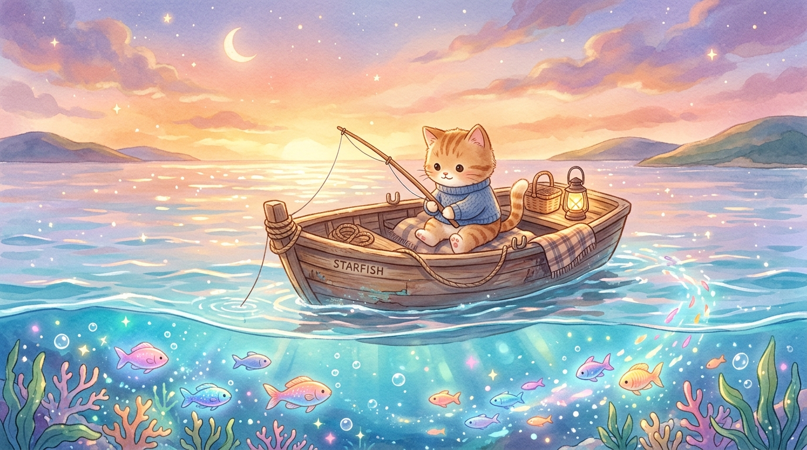

# 🐾 냥이의 바다 낚시 힐링 여행 (Cozy Cat Fishing)

> **"오늘 하루도 수고 많았어, 따뜻한 바다에서 냥이와 함께 편안히 쉬어가렴!"** 🎣🐱✨

인디 명작 《Cat Goes Fishing(고양이 낚시)》의 깊이 있는 낚시 손맛과 따뜻한 힐링 감성을 담아낸 **HTML5 Canvas & Web Audio API 기반 수심 500m 오픈씨 낚시 시뮬레이션 게임**입니다.



---

## 🌟 주요 게임 특징

### 1. 🌊 수심 500m 대확장 & 36종의 풍성한 해양 생태계
- **🌊 표층 바다 (0~30m)**: 아기 멸치, 무지개 구피, 니모 흰동가리, 뽈록 복어, 말랑 해파리, 노랑 나비고기, 꼬마 가자미 (7종)
- **🌅 중층 바다 (30~100m)**: 분홍 참돔, 번개 고등어, 잉크 오징어, 은빛 갈치, 유유자적 바다거북, 날개 날치, 비단 잉어돔, 청새치 (8종)
- **🌌 심해 어둠층 (100~250m)**: 발광 초롱아귀, 전설의 산갈치, 찌그러진 블롭피쉬, 심해 랜턴 상어, 심해 대왕 문어, 고대 투구게, 황금 보물상자, 유리병 편지 (8종)
- **🪐 심연의 해구 (250~400m)**: 고대 실러캔스, 유령 가오리, 거대 주둥이 메가마우스, 투명 유리문어, 심연의 잠자리물고기, 메갈로돈 유령, 심연의 황금 해파리 (7종)
- **👑 미지의 초심연 (400~500m+)**: 은하수를 품은 별빛 고래(Star Whale), 심연의 고대신 크라켄, 바다의 수호신 레비아탄, 별자리 해마, 무지개 우주 거북이, 아틀란티스 신전 유물 (6종)

### 2. ✨ 전 어종 ✨ 이로치 (Shiny) 변종 & 아슬아슬 줄타기 밀당
- 모든 물고기 종마다 **반짝이는 황금빛 별가루 이펙트(`✨`)를 뿜어내는 특별한 이로치 변종**이 출현합니다.
- 잡았을 때 **골드 3배 (`3.0x G`) & 경험치 3배 (`3.0x EXP`)** 보상!
- **체력 소진(탈진) 시스템**: 이로치 물고기와 밀당을 지속하여 지치게 만들면 `✨ 탈진!` 상태가 되어 쉽게 건져 올릴 수 있습니다.
- **방치 탈출 줄타기**: 릴을 완전히 놓고 3초 이상 방치하면 물고기가 바늘을 털고 달아나므로, 팽팽한 밀당 긴장감을 선사합니다!

### 3. 🎒 특수 아이템 & 다중 낚시 리그 (Multi-Hook Rig)
- 🚀 **냥냥 로켓 폭죽**: 캐스팅 시 로켓 불꽃을 뿜으며 2.4배 먼 바다로 초원거리 캐스팅!
- 💣 **심해 어군 폭탄**: 물속에서 **우클릭 (Right-Click)** 시 충격파가 터지며 주변 방해 물고기를 일소!
- 🪝 **2중 & 🔱 3중 찌 바늘 리그**: 낚싯줄에 2개 또는 3개의 바늘을 동시 장착하여 한 번에 여러 마리의 물고기를 동시 낚시!

### 4. 🌅 실시간 자연 환경 & 오로라 밤바다
- 화창한 낮 ☀️ ➔ 황금빛 노을 🌅 ➔ 별빛과 오로라가 춤추는 밤바다 🌌
- 500m 해저 아틀란티스 신전 기둥, 발광 수정, 심해 해저화산 지형 구현

### 5. 🏠 나만의 힐링 아쿠아리움
- 잡은 물고기들이 자유롭게 헤엄치는 수조 모드 (먹이 주기, 힐링 코인 수거, 테마 변경 지원)

### 6. 🎵 100% 브라우저 Web Audio 사운드 합성
- 실제 고양이 음성 포먼트 필터를 적용한 자연스러운 야옹 소리(`냐아앙~!`)
- 로파이(Lo-Fi) 배경음, 파도 소리, 릴링 사운드, 수중 폭발음 자체 합성

---

## 🎮 조작 방법 (Controls)

| 동작 | 조작키 | 설명 |
| :--- | :--- | :--- |
| **캐스팅 충전** | **마우스 클릭 / 스페이스바 홀드** | 파워를 모아 낚싯바늘을 던집니다 |
| **줄 감기 (Reel)** | **마우스 클릭 / 스페이스바 유지** | 낚싯줄을 감아올리며 물고기와 밀당합니다 |
| **보트 항해** | **A / D** 또는 **◀ / ▶ 방향키** | 낚시 중에도 보트를 움직여 포인트를 탐색합니다 |
| **어군 폭탄 격발** | **마우스 우클릭 (Right-Click) / 7 / B** | 물속에서 폭탄을 터뜨려 주변 잡어를 제거합니다 |
| **로켓 폭죽 토글** | **6 또는 R 키** | 다음 캐스팅을 초원거리 로켓 발사로 전환합니다 |
| **다중 바늘 토글** | **8 / 9 키** | 2중 바늘(8) / 3중 바늘(9) 모드 장착 |
| **미끼 선택** | **1 ~ 5 키** | 식빵 / 지렁이 / 생새우 / 루어 / 황금 크릴 선택 |
| **상점 / 도감** | **S 키 / E 키** | 상점(S) 및 36종 생태 도감(E) 열기 |
| **아쿠아리움** | **Q 키** | 힐링 수조 모드로 전환 |
| **소리 켜기/끄기** | **M 키** | 배경음 및 효과음 뮤트 토글 |
| **도움말** | **H 키** | 인게임 가이드 열기 |

---

## 🚀 로컬 실행 방법

```bash
# Node.js 내장 서버로 실행
node server.js
```
브라우저에서 `http://localhost:3000` 접속

---

편안한 음악과 함께 바다의 신비를 탐험하며 행복한 힐링 시간이 되시길 바랍니다! 🐾💖
